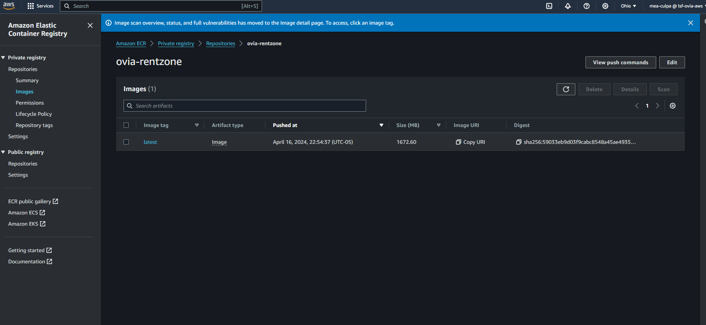

# Dynamic-Website-on-AWS-Using-Docker-ECR-and-ECS.
## Overview
This project implements a dynamic E-commerce web application hosted on AWS using Docker, ECR, and ECS (Elastic Container Service). The infrastructure is built within a Virtual Private Cloud (VPC) with public and private subnets across two availability zones for high availability and fault tolerance.

## Architecture Overview
1. **VPC Configuration**: Utilizes public and private subnets spread across two availability zones.
2. **Internet Gateway (IGW)**: Allows communication between instances in the VPC and the internet.
3. **High Availability and Fault Tolerance**: Leveraging two availability zones.
4. **Security Groups**: Configured at the instance level to serve as a firewall.
5. **Key Resources Placement**:
   - **NAT Gateway**: Enables instances in private subnets to access the internet.
   - **Bastion Host**: Facilitates secure access to resources in both public and private subnets.
   - **Application Load Balancer (ALB)**: Distributes web traffic across an Auto Scaling Group of EC2 instances.
6. **Private Subnets**: House the webservers and database server to ensure protection.
7. **MySQL RDS Database**: Utilized for storing application data.
8. **Database Migration**: Employed Flyway for seamless database migration.
9. **Amazon ECS Fargate**: Chosen as the hosting platform for the website.
10. **Amazon Route 53**: Used for domain registration and creating record sets.
11. **Amazon S3**: Stores web files for the application.
12. **IAM Role**: Permissions granted to ECS to download web files from Amazon S3.

## Deployment Instructions
1. Ensure you have an AWS account and necessary permissions.
2. Set up VPC with public and private subnets across two availability zones.
3. Configure Security Groups for instance-level firewall.
4. Set up NAT Gateway for private subnet internet access.
5. Deploy Bastion Host for secure access to resources.
6. Provision MySQL RDS Database and apply Flyway migrations.
7. Set up ECS Fargate for hosting the website.
8. Configure ALB for web traffic distribution.
9. Register domain name and create record sets in Route 53.
10. Store web files in Amazon S3 and configure IAM Role for ECS access.
11. Update necessary configurations with your specific details.
12. Deploy the application using ECS Fargate.

Docker image for the application created and pushed to the ECR repository

![Alt text}(ovia-rentzone-cluster.png)
ECS cluster for deploying the web application
